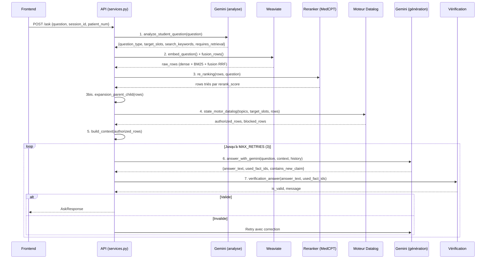

# Pipeline RAG

Ce document décrit le chemin complet d'une question posée par l'étudiant, de la réception HTTP jusqu'au retour de la réponse.

## Flux d'une requête `/ask`



---

## Étape 1 — Analyse de la question

Le LLM analyse la question de l'étudiant pour en extraire la structure sémantique.

```python
# llm_gem.py — analyze_student_question()
class QuestionAnalysis(BaseModel):
    question_type: str          # Ex: "history", "vitals", "allergies"
    target_slots: List[str]     # Ex: ["history_explored", "pain_type_asked"]
    search_keywords: str        # Ex: "douleur dos 3 heures lombalgie"
    requires_retrieval: bool    # False pour les salutations

# Appel avec structured output (JSON garanti)
response = client.models.generate_content(
    model=GEMINI_MODEL,
    contents=prompt,
    config={
        "response_mime_type": "application/json",
        "response_schema": QuestionAnalysis,
        "temperature": 0.1      # Basse pour être déterministe
    }
)
```

Les `target_slots` sont extraits à partir du registre centralisé dans [`config_topics.py`](../Backend/core/config_topics.py) qui définit 12 topics principaux (sections du dossier) et ~25 topics granulaires (sous-thèmes). Le prompt d'analyse inclut cette liste complète comme référence.

**Sortie** : `question_type`, `target_slots`, `requires_retrieval`, `search_keywords`

---

## Étape 2 — Recherche hybride (Retrieval)

La recherche combine deux stratégies puis fusionne les résultats avec un score RRF (Reciprocal Rank Fusion) pondéré par type de source.

### Recherche vectorielle (dense)

```python
# retrieval.py — search_vector()
response = collection.query.near_vector(
    near_vector=query_embedding,        # Embedding BGE-base 768d
    limit=match_count,
    filters=filters,                    # Filtre par patient_id (via metadata_json LIKE)
    return_metadata=wvq.MetadataQuery(distance=True),
)
# Conversion distance → similarité : similarity = 1.0 - distance
```

### Recherche BM25 (sparse)

```python
# retrieval.py — search_bm25()
response = collection.query.bm25(
    query=search_keywords,              # Mots-clés extraits par le LLM
    query_properties=["content"],       # Recherche dans le champ "content" uniquement
    limit=match_count,
    filters=filters,
    return_metadata=wvq.MetadataQuery(score=True),
)
```

### Fusion RRF stratifiée

```python
# retrieval.py — fusion_rows()
# Formule : s_hyb(d_i, q_t) = λ(d_i) × ( α/(k + r_dense) + (1-α)/(k + r_sparse) )
lam = LAYER_WEIGHTS.get(doc["source_type"], 1.0)  # patient: 1.3, reference: 1.0
s_hyb = lam * (alpha / (k + r_dense) + (1 - alpha) / (k + r_sparse))
```

| Paramètre | Valeur | Rôle |
|:-----------|:-------|:-----|
| `α` | 0.5 | Équilibre dense/sparse (0 = tout BM25, 1 = tout vectoriel) |
| `k` | 60 | Constante RRF (atténue les rangs extrêmes) |
| `λ(patient)` | 1.3 | Booste les chunks du dossier patient |
| `λ(reference)` | 1.0 | Poids neutre pour les documents scientifiques |
| `match_count` | 10 | Nombre de résultats par recherche (avant fusion) |

**Sortie** : liste de rows triées par `hybrid_score` décroissant, chaque row contenant `content`, `source_type`, `metadata`, scores.

---

## Étape 3 — Reranking

Le cross-encoder `ncbi/MedCPT-Cross-Encoder` réévalue chaque paire (question, chunk) :

```python
# reranking.py — re_ranking()
for row in rows:
    score = float(model.predict([(question, row["content"])])[0])
    row["rerank_score"] = score
return sorted(rows, key=lambda item: item["rerank_score"], reverse=True)
```

### Expansion parent-child

Pour les documents scientifiques (PDFs), le contenu d'un chunk enfant est remplacé par celui de son parent pour donner plus de contexte au LLM :

```python
# reranking.py — expansion_parent_child()
if source_type != "patient":           # Uniquement pour les PDFs
    parent_content = metadata.get("parent_content")
    if parent_content:
        parent_key = f"{source_file}_{parent_id}"
        if parent_key not in seen_parents:  # Déduplique les parents
            new_row["content"] = parent_content
```

Les chunks patients ne sont pas expansés — chaque fait médical est déjà auto-contenu.

Après expansion, les résultats sont tronqués à `EXCERPT_COUNT` (par défaut 50).

---

## Étape 4 — Filtrage par le moteur Datalog

Les rows passent par le state motor qui utilise le moteur Datalog pour décider quelles informations peuvent être transmises au LLM. Voir le document dédié : [03-moteur-datalog.md](03-moteur-datalog.md).

**Entrée** : `global_asked_topics`, `current_target_slots`, `rows`
**Sortie** : `authorized_rows` (transmis au LLM), `blocked_rows` (tracés mais non transmis)

---

## Étape 5 — Construction du contexte

Les rows autorisées sont formatées en un texte structuré pour le LLM :

```python
# reranking.py — build_context()
# Format pour chaque row :
# [source_type=patient | hybrid_score=0.021311 | ... | fact_id=history_1]
# Patient PAT_001 (Homme, 45 ans) - Catégorie [History] : Douleur lombaire...
parts.append(
    f"[{' | '.join(header_parts)}]\n"
    f"{row['content']}"
)
return "\n\n---\n\n".join(parts)
```

Le contexte inclut tous les scores (hybrid, dense, sparse, rerank) et les metadata (fact_id, source_file, page) pour permettre au LLM de citer ses sources.

---

## Étape 6 — Génération de la réponse

Le LLM incarne un patient virtuel. Le system prompt est crucial :

```python
# llm_gem.py — SYSTEM_PROMPT (extrait)
"""Tu es un patient virtuel participant à un jeu de rôle clinique.
RÈGLES STRICTES :
1. Incarne le patient : Parle toujours à la première personne ("Je")
2. Zéro jargon médical : Si ton dossier dit "Cholécystectomie",
   dis "On m'a enlevé la vésicule biliaire"
3. Réponds UNIQUEMENT à la question posée
4. Respecte ton dossier : Base-toi UNIQUEMENT sur les fragments fournis
5. Gestion de l'inconnu : "Non, rien de particulier"
6. Personnalité : Adopte le trait décrit dans [Ta Personnalité]"""
```

La personnalité est configurable via `patient_attitude` (anxiety, precision, cooperativeness), traduite en texte descriptif par `_format_attitude()` :

| Paramètre | Valeur basse (≤0.2) | Valeur haute (≥0.8) |
|:-----------|:---------------------|:--------------------|
| `anxiety` | « Extrêmement calme, détendu » | « Très anxieux, inquiet, limite paniqué » |
| `precision` | « Très vague, évasif » | « Extrêmement précis, factuel » |
| `cooperativeness` | « Hostile, fermé, réticent » | « Très coopératif, amical » |

La réponse est en **structured output** (JSON garanti) :

```python
class AnswerStruct(BaseModel):
    answer_text: str              # Réponse du patient
    used_fact_ids: List[str]      # fact_ids utilisés
    contains_new_claim: bool      # Info inventée ?
```

---

## Étape 7 — Vérification post-génération

La réponse du LLM est vérifiée avant d'être retournée au frontend :

```python
# verification.py — verification_answer()
def verification_answer(answer_text, used_fact_ids, contains_new_claim, authorized_fact_ids):
    # 1. Rejet si le LLM a inventé une information
    if contains_new_claim is True:
        return False, "La réponse contient de nouvelles affirmations..."
    
    # 2. Rejet si le LLM cite un fait non autorisé par le moteur Datalog
    for fact_id in used_fact_ids:
        if fact_id not in authorized_fact_ids:
            return False, f"La réponse contient un fait non autorisé : {fact_id}."
    
    return True, "La réponse est valide."
```

En cas d'échec, la boucle retry (`MAX_RETRIES = 3`) renvoie le message d'erreur au LLM comme correction :

```python
# services.py — boucle retry
while tentative < MAX_RETRIES:
    raw_answer = answer_with_gemini(..., correction=verification_msg if tentative > 0 else "")
    answer_text, used_fact_ids, contains_new_claim = split_answer_struct(raw_answer)
    is_valid, verification_msg = verification_answer(...)
    if is_valid:
        break
    tentative += 1
```

---

## Étapes post-réponse

Après validation, le pipeline met à jour l'état de la session :

```python
# services.py — tracking
increment_question_count(session_id)
add_message(session_id, "user", question)
add_message(session_id, "assistant", answer_text)
add_asked_topic(session_id, target_slots)       # Mémorise les topics explorés
add_revealed_fact(session_id, used_fact_ids)     # Mémorise les faits révélés
```

Puis génère la **vignette clinique** (résumé structuré des faits révélés) et récupère les images associées aux faits dévoilés.

---

## Configuration des modèles

Définie dans [`config.py`](../Backend/core/config.py) :

| Rôle | Modèle | Dimension | Chargement |
|:-----|:-------|:----------|:-----------|
| Embedding (indexation + recherche) | `BAAI/bge-base-en-v1.5` | 768 | Lazy via `@lru_cache`, preload au startup |
| Cross-encoder (reranking) | `ncbi/MedCPT-Cross-Encoder` | — | Lazy via `@lru_cache`, preload au startup |
| LLM (génération, analyse, évaluation) | `gemini-flash-lite-latest` | — | API Google Gemini |

Les modèles d'embedding et de reranking sont préchargés au démarrage de l'application (`startup_event` dans `main.py`) pour éviter la latence du premier appel.

---

**Fichiers de référence** : [`services.py`](../Backend/api/services.py) · [`retrieval.py`](../Backend/core/rag/retrieval.py) · [`reranking.py`](../Backend/core/rag/reranking.py) · [`llm_gem.py`](../Backend/core/llms/llm_gem.py) · [`verification.py`](../Backend/core/state/verification.py)

→ Suite : [03-moteur-datalog.md](03-moteur-datalog.md)
