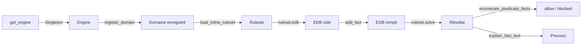

# Moteur Datalog et contrôle d'accès

## Pourquoi un moteur Datalog

Le simulateur doit contrôler **quelles informations médicales** sont révélées à l'étudiant en fonction de l'avancée de la consultation. Un patient réel ne dévoile pas spontanément tout son dossier : il faut poser les bonnes questions, dans le bon ordre.

Trois approches ont été implémentées successivement pour résoudre ce problème :

| Version | Implémentation | Limite |
|:--------|:---------------|:-------|
| `state_motor_simple` | Comparaison string entre `target_slots` et `reveal_policy` | Pas de mémoire inter-questions : un topic exploré à la question 1 est oublié à la question 2 |
| `state_motor_advanced` | Mémoire globale des topics explorés (`all_explored_topics`) | Logique impérative difficile à auditer, pas de traçabilité formelle |
| **`state_motor_datalog`** | Moteur Datalog formel ([maelys-datalog](https://github.com/maelys-dev/maelys-datalog)) | **Version retenue** — déterministe, auditable, preuves exportables |

Le choix d'un moteur Datalog apporte :
- **Déterminisme** : pour un même état (topics explorés + policies), le résultat est toujours identique
- **Traçabilité** : chaque décision est accompagnée d'une preuve (`explain_fact_text`)
- **Séparation données/logique** : les règles sont statiques, seuls les faits EDB changent à chaque requête
- **Auditabilité** : les règles sont lisibles et modifiables sans toucher au code Python

---

## Maelys-datalog

MedSim utilise [**maelys-datalog**](https://github.com/maelys-dev/maelys-datalog), un moteur Datalog borné et déterministe implémenté en C11 avec un binding Python. Ses caractéristiques principales :

- Évaluation semi-naïve en point fixe
- Négation stratifiée avec rejet des cycles négatifs
- Mémoire bornée (pas d'allocation heap pendant le solve)
- Preuves et diagnostics intégrés (`explain_fact_text`)
- API : `Engine` → `register_domain` → `load_inline_ruleset` → `solve` → résultat

La documentation complète est disponible sur le [dépôt GitHub de maelys-datalog](https://github.com/maelys-dev/maelys-datalog). Le binding Python se trouve dans `maelys-datalog/bindings/python/`.

---

## Prédicats

Le domaine `medical_access_control` définit 9 prédicats :

### Prédicats EDB (faits de base — fournis à chaque requête)

```python
# datalog_engine.py — PREDICATES
Predicate('explored',     1, PRED_EDB)   # Topic déjà exploré dans la session
Predicate('current_slot', 1, PRED_EDB)   # Target slot de la question courante
Predicate('has_policy',   2, PRED_EDB)   # (fact_id, policy_string)
Predicate('is_always',    1, PRED_EDB)   # Policy "direct_if_asked" (toujours OK)
Predicate('is_direct',    2, PRED_EDB)   # (policy_string, topic) — autorisé si topic exploré
Predicate('is_only',      2, PRED_EDB)   # (policy_string, topic) — autorisé si exploré + current_slot
Predicate('is_reference', 1, PRED_EDB)   # Fait de type "reference" (toujours autorisé)
```

| Prédicat | Arité | Exemple | Rempli par |
|:---------|:-----:|:--------|:-----------|
| `explored(T)` | 1 | `explored("history_explored")` | Topics de toutes les questions précédentes + slots de la question courante |
| `current_slot(T)` | 1 | `current_slot("pain_type_asked")` | `target_slots` de la question courante uniquement |
| `has_policy(F, P)` | 2 | `has_policy("history_1", "direct_if_history_explored")` | Metadata de chaque chunk patient |
| `is_always(P)` | 1 | `is_always("direct_if_asked")` | Si `policy == "direct_if_asked"` |
| `is_direct(P, T)` | 2 | `is_direct("direct_if_history_explored", "history_explored")` | Si `policy.startswith("direct_if_")` |
| `is_only(P, T)` | 2 | `is_only("only_if_pain_type_asked", "pain_type_asked")` | Si `policy.startswith("only_if_")` |
| `is_reference(F)` | 1 | `is_reference("ref_0")` | Si `source_type == "reference"` |

### Prédicats IDB (faits dérivés — calculés par les règles)

```python
Predicate('allow',   1, PRED_IDB | PRED_QUERY)  # Fait autorisé à être révélé
Predicate('blocked', 1, PRED_IDB | PRED_QUERY)  # Fait bloqué
```

---

## Règles Datalog

Les 5 règles sont **statiques** — elles ne changent jamais. Seuls les faits EDB changent à chaque requête.

```prolog
% Règle 1 : Les faits de référence (documents scientifiques) sont toujours autorisés
allow(F) :- is_reference(F).

% Règle 2 : Les faits avec policy "direct_if_asked" sont toujours autorisés
allow(F) :- has_policy(F, P), is_always(P).

% Règle 3 : Les faits "direct_if_<topic>" sont autorisés si le topic a été exploré
%           (dans la session globale, pas seulement la question courante)
allow(F) :- has_policy(F, P), is_direct(P, T), explored(T).

% Règle 4 : Les faits "only_if_<topic>" sont autorisés si le topic a été exploré
%           ET qu'il fait partie des target_slots de la question courante
allow(F) :- has_policy(F, P), is_only(P, T), explored(T), current_slot(T).

% Règle 5 : Tout fait avec une policy qui n'est pas autorisé est bloqué
blocked(F) :- has_policy(F, P), not(allow(F)).
```

### Différence `direct_if_*` vs `only_if_*`

| Policy | Condition | Exemple |
|:-------|:----------|:--------|
| `direct_if_<topic>` | Le topic a été exploré **à un moment quelconque** de la consultation | L'étudiant a posé des questions sur les antécédents → tous les faits `direct_if_past_medical_history_explored` sont débloqués, même si la question courante porte sur autre chose |
| `only_if_<topic>` | Le topic a été exploré **ET** fait partie des `target_slots` de la question **courante** | L'étudiant pose une question sur la douleur → les faits `only_if_pain_type_asked` sont autorisés seulement si la question porte sur ce topic précisément |

---

## Cycle de vie



1. **Création de l'Engine** : singleton via `get_engine()`. Créé une seule fois au premier appel.
2. **Enregistrement du domaine** : `engine.register_domain("medical_access_control", PREDICATES)` — définit les 9 prédicats.
3. **Chargement des règles** : `engine.load_inline_ruleset(...)` — charge les 5 règles statiques. Singleton via `get_ruleset()`.
4. **À chaque requête** : créer un EDB frais (`ruleset.edb()`), y ajouter les faits, résoudre, extraire les résultats.
5. **Fermeture** : `close_engine()` appelé au shutdown de FastAPI (`shutdown_event`).

### Code d'exécution (par requête)

```python
# state_motor.py — state_motor_datalog() (simplifié)
ruleset = get_ruleset()
edb = ruleset.edb()

# 1. Ajouter les topics explorés
for topic in all_explored_topics:
    edb.add_fact('explored', [topic])
for slot in current_target_slots:
    edb.add_fact('current_slot', [slot])

# 2. Ajouter les faits et classifier les policies
for fact_id, policy, row_idx, is_ref in fact_rows:
    if is_ref:
        edb.add_fact('is_reference', [fact_id])
    else:
        edb.add_fact('has_policy', [fact_id, policy])
        if policy == "direct_if_asked":
            edb.add_fact('is_always', [policy])
        elif policy.startswith("direct_if_"):
            topic = policy[len("direct_if_"):]
            edb.add_fact('is_direct', [policy, topic])
        elif policy.startswith("only_if_"):
            topic = policy[len("only_if_"):]
            edb.add_fact('is_only', [policy, topic])

# 3. Résoudre
result = ruleset.solve(edb)

# 4. Extraire les résultats
allowed_facts = set()
for row in result.enumerate_predicate_facts('allow', 1):
    allowed_facts.add(row[0])

# 5. Preuves (pour le debug)
for fact_id in allowed_facts:
    explanation = result.explain_fact_text('allow', [fact_id])
```

---

## Conventions `reveal_policy`

Les policies sont définies dans les dossiers patients JSON et dans `config_topics.py` :

| Policy | Format | Exemple | Signification |
|:-------|:-------|:--------|:--------------|
| `direct_if_asked` | Constante | — | Toujours révélé (motif de consultation, info de base) |
| `direct_if_<topic>` | `direct_if_` + topic | `direct_if_history_explored` | Révélé facilement dès que le topic est exploré |
| `only_if_<topic>` | `only_if_` + topic | `only_if_pain_type_asked` | Révélé uniquement si le topic est exploré ET que la question courante porte dessus |

La fonction `_extract_topic_from_policy()` dans `state_motor.py` parse ces conventions :

```python
def _extract_topic_from_policy(reveal_policy):
    if reveal_policy == "direct_if_asked":
        return None  # Toujours autorisé, pas de topic requis
    if reveal_policy.startswith("direct_if_"):
        return reveal_policy[len("direct_if_"):]
    if reveal_policy.startswith("only_if_"):
        return reveal_policy[len("only_if_"):]
    return None
```

---

## Tableau des cas autorisés / bloqués

| Cas | `source_type` | `reveal_policy` | Topics explorés | Question courante | Résultat | Règle |
|:----|:--------------|:-----------------|:----------------|:------------------|:---------|:------|
| Document scientifique | `reference` | — | — | — | ✅ Autorisé | R1 |
| Motif de consultation | `patient` | `direct_if_asked` | — | — | ✅ Autorisé | R2 |
| Antécédent médical | `patient` | `direct_if_past_medical_history_explored` | `past_medical_history_explored` ∈ explorés | — | ✅ Autorisé | R3 |
| Antécédent médical | `patient` | `direct_if_past_medical_history_explored` | Topic **pas** exploré | — | ❌ Bloqué | R5 |
| Type de douleur | `patient` | `only_if_pain_type_asked` | `pain_type_asked` ∈ explorés | `pain_type_asked` ∈ slots | ✅ Autorisé | R4 |
| Type de douleur | `patient` | `only_if_pain_type_asked` | `pain_type_asked` ∈ explorés | Autre question | ❌ Bloqué | R5 |

---

## Vérification post-génération

Après la génération par le LLM, le module `verification.py` vérifie que la réponse ne contient que des faits autorisés :

```python
# verification.py — verification_answer()
# 1. Rejet si le LLM invente une information (contains_new_claim)
# 2. Rejet si le LLM cite un fact_id non autorisé par le moteur Datalog
```

Le module contient aussi `verify_diagnosis()` pour la comparaison des diagnostics, avec un dictionnaire de **synonymes médicaux** (~30 entrées) :

```python
SYNONYMS = {
    "lombalgie": ["lumbago", "mal de dos", "douleur lombaire", "tour de rein", ...],
    "infarctus du myocarde": ["crise cardiaque", "idm", "infarctus", ...],
    "pneumonie": ["pneumopathie", "infection pulmonaire", ...],
    "infection urinaire": ["iu", "cystite", "cystite aigue"],
    # ... ~30 entrées
}
```

La comparaison normalise les textes (minuscules, suppression des accents, trim) puis vérifie la correspondance exacte ou par synonyme.

---

## Impact d'une modification des règles

> **Attention** : modifier les règles Datalog modifie directement quelles informations sont révélées à l'étudiant.

### Procédure pour modifier une règle

1. Modifier `RULES_SOURCE` dans [`datalog_engine.py`](../Backend/core/state/datalog_engine.py)
2. **Redémarrer le backend** — le singleton `_ruleset` est recréé
3. Tester manuellement avec une consultation complète en vérifiant les logs `[STATE MOTOR]`

### Procédure pour ajouter un nouveau prédicat

1. Ajouter le `Predicate` dans `PREDICATES` dans `datalog_engine.py`
2. Ajouter la logique de classification dans `state_motor_datalog()` dans `state_motor.py`
3. Ajouter la règle correspondante dans `RULES_SOURCE`
4. Redémarrer le backend

### Ce qu'il ne faut pas faire

- Ne pas utiliser de **string literals** dans les règles (ex. : `allow(F) :- has_policy(F, "direct_if_asked")`) — le registre de domaine ne connaît pas ces atomes. Utiliser les prédicats EDB `is_always`, `is_direct`, `is_only` à la place.
- Ne pas modifier les prédicats `allow` et `blocked` — ce sont les sorties du moteur, pas les entrées.

---

**Fichiers de référence** : [`datalog_engine.py`](../Backend/core/state/datalog_engine.py) · [`state_motor.py`](../Backend/core/state/state_motor.py) · [`verification.py`](../Backend/core/state/verification.py) · [maelys-datalog (GitHub)](https://github.com/maelys-dev/maelys-datalog)

→ Suite : [04-evaluation-et-scoring.md](04-evaluation-et-scoring.md)
