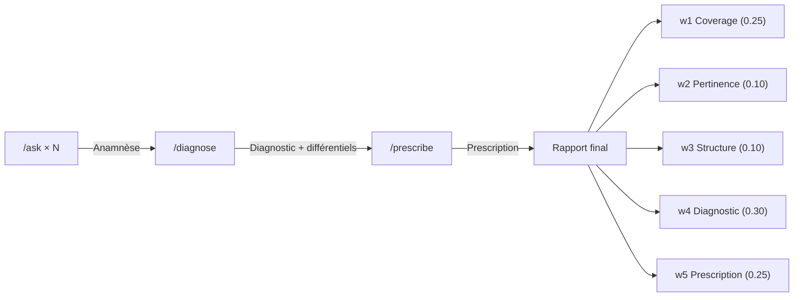

# Évaluation et scoring

Le système d'évaluation note l'étudiant sur 5 indicateurs pondérés après qu'il ait soumis un diagnostic et une prescription.

## Flux d'évaluation



Le flux en deux étapes est intentionnel :
1. **`/diagnose`** : évalue le diagnostic, retourne un feedback mais **pas** le rapport (le stocke en cache)
2. **`/prescribe`** : évalue la prescription, récupère le diagnostic en cache, calcule le rapport final complet

Ce séquençage garantit que l'étudiant ne voit pas sa note de diagnostic avant d'avoir prescrit.

---

## Les 5 indicateurs

### Score final

```
Score = w1·Coverage + w2·Pertinence + w3·Structure + w4·Diagnostic + w5·Prescription + Bonus
```

```python
# scoring.py — SCORING_WEIGHTS
SCORING_WEIGHTS = {
    "w1_coverage":     0.25,   # Couverture de l'anamnèse
    "w2_pertinence":   0.10,   # Pertinence des questions
    "w3_structure":    0.10,   # Structure de l'entretien
    "w4_diagnostic":   0.30,   # Performance diagnostique
    "w5_prescription": 0.25,   # Qualité de la prescription
}
```

Le score final est dans `[0, 1]`, augmenté d'un bonus optionnel pour les diagnostics différentiels (plafonné à `min(1.0, score + bonus)`).

---

### 1. Couverture de l'anamnèse (`w1 = 0.25`)

Mesure la proportion de thèmes médicaux importants que l'étudiant a explorés.

```python
# scoring.py — compute_coverage()
def compute_coverage(asked_topics_history, patient_data):
    important = _extract_important_topics(patient_data)  # Sections non vides du JSON
    explored = _flatten_asked_topics(asked_topics_history)
    covered = explored & important
    return len(covered) / len(important)
```

- **`important`** : les topics correspondant aux sections non vides du dossier patient. Le mapping est dans `config.py` :

```python
# config.py — SECTION_TO_TOPIC
SECTION_TO_TOPIC = {
    "chief_complaint": "context_explored",
    "history": "history_explored",
    "past_medical_history": "past_medical_history_explored",
    "surgical_history": "surgical_history_explored",
    "family_history": "family_history_explored",
    "treatments": "medication_asked",
    "allergies": "allergies_asked",
    "social_history": "social_history_explored",
    "travel_history": "travel_history_explored",
    "risk_factors": "risk_factors_explored",
    "vitals": "vitals_measured",
}
```

- **`explored`** : tous les `target_slots` extraits de chaque question posée par l'étudiant (cumulés dans le cache de session)

**Résultat** : `float ∈ [0, 1]`. Si le patient n'a aucune section renseignée, retourne `1.0` par défaut.

---

### 2. Pertinence des questions (`w2 = 0.10`)

Ratio de questions « utiles » sur le total de questions posées.

```python
# scoring.py — compute_pertinence()
def compute_pertinence(useful_count, total_count):
    if total_count <= 0:
        return 0.0
    return min(1.0, useful_count / total_count)
```

Une question est comptée comme **utile** si `requires_retrieval == True` dans l'analyse LLM (c'est-à-dire si elle nécessite une recherche dans le dossier patient, par opposition aux salutations ou questions hors sujet).

---

### 3. Structure de l'entretien (`w3 = 0.10`)

Compare l'ordre d'exploration de l'étudiant à l'ordre clinique idéal via le **coefficient de Kendall tau**.

```python
# scoring.py — compute_structure()
def compute_structure(asked_topics_history, ideal_order=None):
    student_order = _ordered_first_appearances(asked_topics_history, reference_set)
    ideal_ranks = [ideal_order.index(t) for t in student_order]
    student_ranks = list(range(len(student_order)))
    tau = _kendall_tau(student_ranks, ideal_ranks)
    return (tau + 1) / 2   # Normalisation [-1, 1] → [0, 1]
```

L'ordre clinique idéal (enseigné aux étudiants en médecine) est défini dans `config.py` :

```python
# config.py — IDEAL_TOPIC_ORDER
IDEAL_TOPIC_ORDER = [
    "context_explored",                # 1. Motif de la venue
    "past_medical_history_explored",   # 2. Antécédents personnels
    "surgical_history_explored",       # 3. Antécédents chirurgicaux
    "family_history_explored",         # 4. Antécédents familiaux
    "medication_asked",                # 5. Traitements
    "allergies_asked",                 # 6. Allergies
    "substance_use_explored",          # 7. Substances
    "social_history_explored",         # 8. Mode de vie
    "travel_history_explored",         # 9. Voyages
    "risk_factors_explored",           # 10. Facteurs de risque
    "history_explored",                # 11. Histoire de la maladie
    "pain_characteristics_explored",   # 12. Caractéristiques douleur
    "associated_symptoms_explored",    # 13. Symptômes associés
    "vitals_measured",                 # 14. Constantes vitales
]
```

Le coefficient de Kendall tau est implémenté sans dépendance externe (`_kendall_tau` dans `scoring.py`) :
- `τ = 1` → ordre parfait
- `τ = 0` → ordre aléatoire
- `τ = -1` → ordre inversé

Normalisé sur `[0, 1]` : `(τ + 1) / 2`.

---

### 4. Performance diagnostique (`w4 = 0.30`)

Poids le plus élevé. Basé sur la justesse du diagnostic et le temps de consultation.

```python
# scoring.py — compute_diagnostic()
def compute_diagnostic(is_correct, elapsed_seconds, time_limit=SESSION_TIME_LIMIT):
    if not is_correct:
        return 0.0                          # Diagnostic incorrect → 0
    if elapsed_seconds > time_limit:
        return 0.3                          # Correct mais hors temps → 0.3
    # Correct et dans le temps → bonus de rapidité
    time_remaining_ratio = (time_limit - elapsed_seconds) / time_limit
    return 0.5 + 0.5 * time_remaining_ratio  # ∈ [0.5, 1.0]
```

| Cas | Score |
|:----|:------|
| Diagnostic incorrect | 0.0 |
| Correct, temps dépassé (> 10 min) | 0.3 |
| Correct, pile à 10 min | 0.5 |
| Correct, en 5 min | 0.75 |
| Correct, instantané | 1.0 |

Le chronomètre démarre à l'initialisation de la session (`start_timestamp` dans `cache.py`).

#### Vérification du diagnostic

```python
# verification.py — verify_diagnosis()
# 1. Normalisation : minuscules, suppression accents, trim
# 2. Correspondance exacte normalisée
# 3. Correspondance par dictionnaire de synonymes (~30 entrées)
```

---

### 5. Qualité de la prescription (`w5 = 0.25`)

Évaluation par le LLM (Gemini) de la prescription de l'étudiant vs. le traitement attendu.

```python
# llm_gem.py — evaluate_prescription_with_gemini()
class PrescriptionEvaluation(BaseModel):
    molecule_score: float               # Molécules correctes (0-1)
    dosage_score: float                 # Posologie dans les fourchettes (0-1)
    route_score: float                  # Voie d'administration correcte (0-1)
    duration_score: float               # Durée appropriée (0-1)
    contraindications_respected: bool   # Pas de CI violée
    overall_score: float                # Score global pondéré (0-1)
    feedback: str                       # Retour pédagogique
    expected_molecules: List[str]
    prescribed_molecules: List[str]     # Normalisés en DCI
    missed_molecules: List[str]
    contraindication_details: str
```

Le score global suggéré au LLM : `0.35×molecule + 0.25×dosage + 0.15×route + 0.15×duration + 0.10×(CI)`.

Le LLM accepte les **noms commerciaux courants** (Doliprane = Paracétamol, Advil = Ibuprofène, Monuril = Fosfomycine, etc.) et est tolérant sur les formulations de posologie (`"1g x3/j"` ≈ `"1g toutes les 6 heures"`).

Le traitement attendu est défini dans les métadonnées du dossier patient :

```json
{
  "metadata": {
    "expected_treatment": {
      "molecules": [
        {"name": "Paracétamol", "dosage": "1g x3/j", "route": "orale", "duration": "5 jours"}
      ],
      "contraindications_to_check": ["insuffisance hépatique"]
    }
  }
}
```

---

### Bonus : diagnostics différentiels

```python
# scoring.py — compute_differential_bonus()
def compute_differential_bonus(differential_diagnoses, patient_data, is_final_correct):
    # Diagnostic incorrect → 0 (le bonus ne compense pas)
    # 1 différentiel pertinent matché → +0.05
    # 2+ différentiels pertinents matchés → +0.10
```

Le matching compare les hypothèses de l'étudiant avec `metadata.alternative_diagnoses` via un **matching lexical** : partage d'au moins un mot significatif (≥4 caractères) après normalisation.

---

## Rapport final

Le rapport est un dict structuré retourné par `/prescribe` :

```python
# scoring.py — generate_report() → structure de sortie
{
    "scores": {
        "coverage": 0.82,      # Sous-scores individuels
        "pertinence": 0.75,
        "structure": 0.68,
        "diagnostic": 1.00,
        "prescription": 0.85,
    },
    "weights": SCORING_WEIGHTS,
    "final_score": 0.86,       # Score pondéré
    "grade": "B",              # Note lettrée
    "details": {
        "important_topics": ["context_explored", "history_explored", ...],
        "explored_topics": ["context_explored", "history_explored", ...],
        "missed_topics": ["travel_history_explored"],
        "useful_questions": 8,
        "total_questions": 12,
        "diagnosis_correct": True,
        "elapsed_time": "7:23",
        "time_limit": "10:00",
        "within_time": True,
        "prescription_details": { ... },
        "differential_diagnoses": ["Sciatique", "Hernie discale"],
        "matched_differentials": ["Sciatique"],
        "differential_bonus": 0.05,
    }
}
```

### Grille de notation

```python
# scoring.py — _score_to_grade()
A : ≥ 0.90
B : ≥ 0.75
C : ≥ 0.60
D : ≥ 0.40
F : < 0.40
```

---

## Mode pédagogique

Activé via `is_pedago_mode: true` dans la requête `/ask`. Ajoute deux éléments à chaque réponse :

### 1. Évaluation pédagogique

```python
# llm_gem.py — evaluate_student_question_pedagogy()
class PedagogyAnalysis(BaseModel):
    is_pertinent: bool          # La question est-elle pertinente à ce stade ?
    feedback: str               # Retour pédagogique (2-3 phrases)
    scientific_keywords: str    # Mots-clés pour la recherche théorique
```

Le LLM évalue la question en tenant compte de l'historique de la consultation et du diagnostic attendu.

### 2. Synthèse théorique

Si des mots-clés scientifiques sont identifiés, un second pipeline RAG recherche dans les documents scientifiques (PDFs) uniquement (`filter_source_type="reference"`) et génère une mini-revue de cours :

```python
# services.py — mode pédagogique
sci_emb = embed_question(sci_keywords, mod)
sci_rows = fusion_rows(sci_emb, sci_keywords, filter_source_type="reference")
sci_rows = re_ranking(sci_rows, sci_keywords, ce)
sci_context = build_context(sci_rows[:3])
pedagogical_synthesis = generate_pedagogical_synthesis(question, sci_context, api_key)
```

---

**Fichiers de référence** : [`scoring.py`](../Backend/core/evaluation/scoring.py) · [`diagnostic.py`](../Backend/core/evaluation/diagnostic.py) · [`prescription.py`](../Backend/core/evaluation/prescription.py) · [`config.py`](../Backend/core/config.py)

→ Suite : [05-ingestion-et-benchmarks.md](05-ingestion-et-benchmarks.md)
