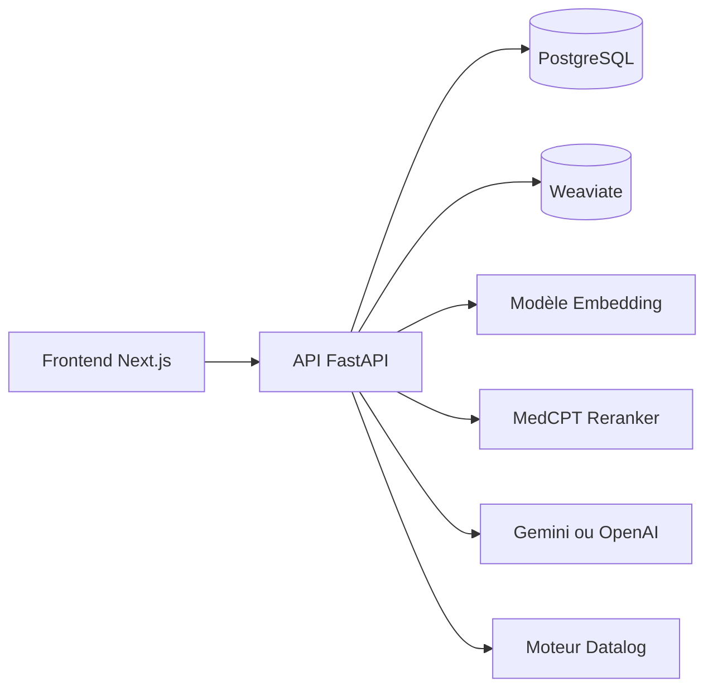

## 1. Structure recommandée

```text
README.md
CONTRIBUTING.md
docs/
├── 00-vue-ensemble.md
├── 01-installation-developpement.md
├── 02-architecture.md
├── 03-backend.md
├── 04-frontend.md
├── 05-pipeline-rag.md
├── 06-moteur-datalog-et-securite.md
├── 07-base-de-donnees.md
├── 08-api.md
├── 09-ingestion-et-benchmarks.md
├── 10-deploiement-et-exploitation.md
├── 11-tests-et-validation.md
├── 12-depannage.md
├── 13-limites-et-evolutions.md
└── decisions/
    ├── 001-choix-weaviate.md
    ├── 002-choix-du-modele-embedding.md
    └── 003-gestion-des-acces.md
```

Tu peux aussi conserver une documentation plus spécifique dans `Backend/docs/`, mais une documentation globale dans `docs/` sera plus facile à trouver.

## 2. Contenu du README classique

Le README doit permettre à une nouvelle personne de démarrer le projet en moins de quinze minutes.

### Sections conseillées

1. **Présentation**
   - Objectif de MedSim.
   - Public cible.
   - Fonctionnalités principales.
   - Technologies utilisées.

2. **Architecture très simplifiée**
   - Frontend Next.js.
   - Backend FastAPI.
   - PostgreSQL.
   - Weaviate.
   - Modèles d’embedding, reranking et LLM.

3. **Prérequis**
   - Versions Python, Node.js, Docker et npm.
   - Besoin éventuel d’une clé Gemini.
   - Préciser si un GPU est facultatif.

4. **Installation**
   - Clonage du projet.
   - Création de l’environnement virtuel Python.
   - Installation de `requirements.txt`.
   - Installation des dépendances frontend.
   - Création des fichiers `.env`.

5. **Démarrage**
   - Lancement de Docker.
   - Initialisation PostgreSQL.
   - Lancement du backend.
   - Lancement du frontend.
   - URLs disponibles :
     - `http://localhost:3000`
     - `http://localhost:8000`
     - `http://localhost:8000/docs`

6. **Initialisation des données**
   - Exécution de `Backend/ingest.py`.
   - Documents patients.
   - Documents scientifiques.
   - Temps approximatif.
   - Comment vérifier que Weaviate contient bien les données.

7. **Première utilisation**
   - Création d’un compte.
   - Sélection d’un patient.
   - Déroulement d’une consultation.
   - Diagnostic.
   - Prescription.
   - Évaluation.

8. **Dépannage rapide**
   - Port déjà utilisé.
   - PostgreSQL inaccessible.
   - Weaviate inaccessible.
   - Modèle Hugging Face en cours de téléchargement.
   - Clé API absente.
   - Erreur de dépendance Python.

9. **Liens vers la documentation technique**
   - Architecture détaillée.
   - API.
   - Pipeline RAG.
   - Moteur de règles.
   - Benchmarks.

Le README doit rester court. Il ne faut pas y expliquer chaque classe ou chaque algorithme.

## 3. Contenu de la documentation technique

### `00-vue-ensemble.md`

Présenter le contexte du projet :

- Problématique du stage.
- Objectifs fonctionnels.
- Objectifs techniques.
- Fonctionnalités implémentées.
- Fonctionnalités volontairement non implémentées.
- Vocabulaire utilisé : patient, session, topic, chunk, embedding, reranking, policy, etc.

Cette page doit permettre de comprendre le projet sans lire le code.

### `02-architecture.md`

Décrire les composants et leurs communications :



Pour chaque composant, préciser :

- Sa responsabilité.
- Les fichiers principaux.
- Les entrées et sorties.
- Les dépendances.
- Les erreurs possibles.
- Ce qui peut être modifié sans affecter les autres composants.

### `03-backend.md`

Décrire le backend par couches :

- `api/` : routes HTTP et schémas.
- `core/` : logique métier.
- `core/rag/` : chunking, embedding, recherche et reranking.
- `core/llms/` : communication avec les modèles de langage.
- `db/` : modèles SQLAlchemy et sessions.
- `ingest.py` : ingestion des données.

Pour chaque module important, ajouter un tableau :

| Module | Responsabilité | Entrées | Sorties | Dépendances |
|---|---|---|---|---|
| `retrieval.py` | Recherche de documents pertinents | Question, filtres | Chunks | Weaviate |
| `reranking.py` | Réordonner les résultats | Question, chunks | Résultats classés | MedCPT |
| `scoring.py` | Calcul de la note | Diagnostic, prescription | Rapport d’évaluation | PostgreSQL |

### `05-pipeline-rag.md`

C’est une partie importante de ton projet. Décris le chemin complet d’une question :

1. Question envoyée par le frontend.
2. Analyse de la question.
3. Identification du thème ou du topic.
4. Recherche dans Weaviate.
5. Génération des embeddings.
6. Reranking des résultats.
7. Vérification des informations accessibles.
8. Génération de la réponse par le LLM.
9. Mise à jour de l’état de la consultation.
10. Retour de la réponse au frontend.

Explique aussi :

- Les stratégies de chunking.
- Le modèle d’embedding utilisé.
- Le modèle de reranking.
- Le nombre de documents récupérés.
- La gestion des erreurs LLM.
- La différence entre les documents patients et les documents scientifiques.
- Les raisons des choix techniques.

### `06-moteur-datalog-et-securite.md`

La logique du fichier [Backend/core/datalog_engine.py](Backend/core/datalog_engine.py) mérite une documentation dédiée.

Il faut expliquer :

- Pourquoi un moteur Datalog est utilisé.
- Le rôle du singleton `Engine`.
- Le domaine `medical_access_control`.
- Les prédicats EDB :
  - `explored`
  - `current_slot`
  - `has_policy`
  - `is_always`
  - `is_direct`
  - `is_only`
  - `is_reference`
- Les prédicats calculés :
  - `allow`
  - `blocked`
- La signification de chaque règle.
- Le cycle de vie :
  - création de l’engine ;
  - enregistrement du domaine ;
  - chargement des règles ;
  - exécution ;
  - fermeture avec `close_engine()`.
- Les conséquences d’une modification des règles.
- Les cas autorisés et bloqués avec des exemples.

Par exemple :

| Cas | Résultat |
|---|---|
| Fait de référence | Autorisé immédiatement |
| Politique `direct_if_asked` | Toujours autorisée |
| Politique directe sur un topic déjà exploré | Autorisée |
| Politique `only_if_asked` sur le topic courant | Autorisée |
| Autre cas | Bloqué |

Il faut également documenter les données sensibles et les limites de sécurité. Une personne reprenant le projet doit comprendre que modifier une règle peut modifier directement les informations révélées à l’utilisateur.

### `07-base-de-donnees.md`

Documenter :

- Les tables PostgreSQL.
- Les relations entre les tables.
- Les enums comme `UserRole`.
- Les données persistées.
- Les données conservées uniquement en session.
- La procédure d’initialisation.
- La procédure de réinitialisation en développement.
- Les migrations, si elles existent.
- Les données qui ne doivent jamais être supprimées en production.

Ajouter un schéma simple des relations si nécessaire.

### `08-api.md`

Même si Swagger existe à `/docs`, ajoute une documentation stable des endpoints principaux :

| Méthode | Route | Authentification | Description |
|---|---|---|---|
| `POST` | `/api/auth/login` | Non | Connexion |
| `GET` | `/api/patients` | Oui | Liste des patients |
| `POST` | `/api/ask` | Oui | Poser une question |
| `POST` | `/api/diagnose` | Oui | Soumettre un diagnostic |
| `POST` | `/api/prescribe` | Oui | Soumettre une prescription |

Pour les routes importantes, documenter :

- Exemple de requête.
- Exemple de réponse.
- Codes d’erreur.
- Authentification nécessaire.
- Effets secondaires éventuels.

### `09-ingestion-et-benchmarks.md`

Décrire :

- Les formats acceptés : JSON patients et PDF scientifiques.
- Le fonctionnement de `Backend/ingest.py`.
- Le découpage des documents.
- La création des embeddings.
- Le stockage dans Weaviate.
- La manière de relancer l’ingestion.
- Les risques de doublons.
- Les scripts présents dans `Benchmark/`.
- L’emplacement des résultats.
- L’interprétation des métriques.

Les choix de chunking, embedding et reranking doivent être justifiés avec les résultats des benchmarks, pas uniquement décrits.

### `10-deploiement-et-exploitation.md`

Même si le projet est principalement exécuté en développement, documente :

- Variables d’environnement.
- Gestion des secrets.
- Ports réseau.
- Volumes Docker.
- Téléchargement et cache des modèles.
- Commandes de démarrage et d’arrêt.
- Sauvegarde PostgreSQL.
- Sauvegarde ou reconstruction de Weaviate.
- Logs à consulter.
- Vérifications de santé.
- Différences entre développement et production.

Ne jamais mettre de vraie clé API dans la documentation.

### `11-tests-et-validation.md`

Lister les vérifications à effectuer après une modification :

```bash
# Backend
python -m db.init_db

# Frontend
npm run lint
npm run build

# Services
docker compose ps
```

Ajouter également des scénarios fonctionnels :

- Inscription.
- Connexion.
- Consultation d’un patient.
- Question autorisée.
- Question qui doit être bloquée.
- Diagnostic.
- Prescription.
- Déconnexion.
- Réinitialisation d’une session.

Pour chaque test, préciser le résultat attendu.

### `12-depannage.md`

Créer un tableau plus complet que celui du README :

| Symptôme | Cause possible | Diagnostic | Solution |
|---|---|---|---|
| `connection refused` PostgreSQL | Conteneur arrêté | `docker compose ps` | `docker compose up -d` |
| Réponse LLM impossible | Clé absente ou quota dépassé | Logs backend | Vérifier `.env` |
| Recherche vide | Collection Weaviate absente | Vérifier Weaviate | Relancer l’ingestion |
| Backend lent au démarrage | Modèles téléchargés | Logs startup | Attendre la fin du chargement |

## 4. Ajouter une documentation des décisions

Pour un projet de stage, il est très utile d’expliquer non seulement **ce qui a été fait**, mais aussi **pourquoi**.

Chaque décision importante peut suivre ce format :

```markdown
# Choix de Weaviate pour la recherche vectorielle

## Contexte

Le système doit rechercher rapidement des chunks médicaux pertinents.

## Options étudiées

- PostgreSQL uniquement
- FAISS
- Weaviate

## Décision

Utiliser Weaviate.

## Raisons

- API adaptée à la recherche vectorielle
- Persistance disponible
- Intégration simple avec le backend

## Conséquences

- Nécessite Docker
- Les données doivent être réindexées après modification du modèle
```

Cela évite qu’un futur développeur remplace une technologie sans comprendre les contraintes initiales.

## 5. Ajouter un fichier `CONTRIBUTING.md`

Ce fichier peut expliquer :

- Où placer une nouvelle fonctionnalité.
- Comment nommer les fichiers.
- Comment lancer les tests.
- Comment modifier l’API.
- Comment modifier les règles Datalog.
- Comment ajouter un document médical.
- Comment lancer les benchmarks.
- Comment vérifier qu’une modification n’a pas cassé le frontend.
- Comment rédiger un commit.

## 6. Méthode de rédaction recommandée

Pour chaque fonctionnalité, réponds systématiquement à ces questions :

1. Quel problème cette fonctionnalité résout-elle ?
2. Où est-elle implémentée ?
3. Quelles sont ses entrées ?
4. Quelles sont ses sorties ?
5. De quelles dépendances a-t-elle besoin ?
6. Que se passe-t-il en cas d’erreur ?
7. Comment la tester ?
8. Quelles parties peut-on modifier sans risque ?
9. Quelles sont ses limites connues ?
10. Quelle est la procédure de dépannage ?

La documentation doit être écrite pour une personne qui ne connaît pas ton stage et qui découvre le projet avec uniquement le dépôt sous les yeux.

## 7. Checklist finale de qualité

Avant de rendre le projet, une autre personne doit pouvoir :

- Installer les dépendances sans te poser de question.
- Créer les fichiers `.env`.
- Démarrer PostgreSQL et Weaviate.
- Initialiser la base.
- Lancer le backend et le frontend.
- Ingérer les documents.
- Utiliser une consultation complète.
- Comprendre l’architecture.
- Trouver le code responsable d’une fonctionnalité.
- Modifier une règle Datalog sans casser le moteur.
- Relancer les tests et les benchmarks.
- Diagnostiquer les erreurs courantes.
- Comprendre les limites du projet.
- Identifier les évolutions possibles.

Le meilleur test consiste à remettre le dépôt à une personne qui ne connaît pas le projet et à lui demander de suivre uniquement le README. Toutes les questions qu’elle pose deviennent ensuite des corrections ou des ajouts à la documentation.
